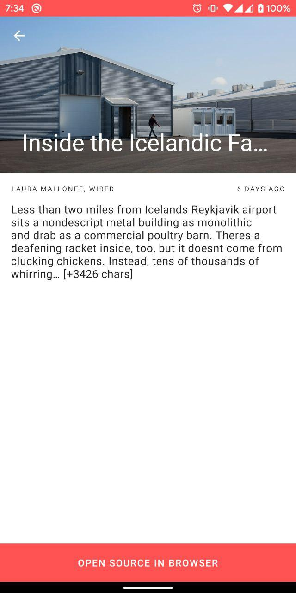

# News
This is a project that displays articles from [NewsAPI](https://newsapi.org/).

 

## Running 
To run the application from source, you should first provide the News API key via `local.properties`: 
`API_KEY=YOUR_KEY_HERE`

## Technologies used
- Single activity 
- Coroutines
- airbnb/Epoxy for displaying items easily in RecyclerView 
- Dagger2 for DI
- Room 
- Coroutines for doing async jobs
- Retrofit
- Moshi 
- LeakCanary and Chuck for debug purposes
- JUnit and Mockk for testing 
