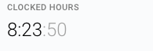

# News
This is a project that displays articles from [NewsAPI](https://newsapi.org/).

There are two screens in the app: 
- ArticlesListFragment - displays the list of articles 
- ArticleDetailFragment - displays the detailed info of an article

Initially the application opens with "bitcoin" query, but there is a functionality to change the query by pressing the search button in the toolbar. 

When articles are loaded from network, we save them into the Room to open article details, to avoid loading the article from network.

Since there are no IDs returned from the NewsAPI, we use article title as a key to navigate to the detail screen from the list.
 
Articles in the DB get cleared when opening application for the first time. 

  
Time spent on the app: 
  

  
 

## Technologies used
- Single activity 
- airbnb/Epoxy for displaying items easily in RecyclerView 
- Dagger2 for DI
- Room 
- Coroutines for doing async jobs
- Retrofit
- Moshi 
- LeakCanary and Chuck for debug purposes
- JUnit and Mockk for testing 